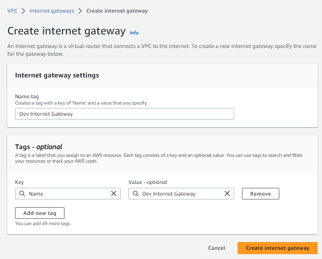

# DEPLOY A STATIC WEBSITE ON AWS

## VPC SETUP

Create a VPC with options as shown in the image below -

Enable **"DNS HOSTNAMES"** in the VPC settings. (**This is done so that instances launched in the VPC receive public DNS hostnames that correspond to their public IP addresses.**)

As highlighted above, click on the **Actions** drop down and the select "**Edit VPC settings**"

Ensure "**Enable DNS hostnames**" is checked, then save.

Create an Internet gateway and attach it to the VPC(**An internet gateway allows internet access into our VPC**)

